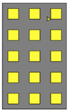

Le but de cette séance est de continuer à vous habituer à la programmation en Python et notamment aux notions de :

* structures conditionnelles ;
* boucles ;
* fonction.

Pour cela, nous manipulerons le module `turtle`{.python} dont le principe est de suivre dans une fenêtre l'évolution d'une tortue (symbolisée par une flèche) qui suivra vos instructions à la lettre.

# Travail à préparer chez vous avant la séance

1. Quels sont les prototypes (liste d'arguments et leur type, liste de valeurs de retours et leur type) des fonctions `rectangle`, `carre` et `immeuble` présentées dans la section [L'immeuble] ci-dessous ?

# Présentation du module `turtle`

Lors de cette séance de TD, vous serez ammenés à faire appel aux fonctions de base du module `turtle`{.python} suivantes :

* `turtle.forward(dist)`{.python} : faire avancer la tortue de `dist`{.python} unités ;
* `turtle.left(alpha)`{.python} : faire tourner la tortue sur la gauche d'un angle de `alpha`{.python} degrés ;
* `turtle.right(alpha)`{.python} : faire tourner la tortue sur la droite d'un angle de `alpha`{.python} degrés ;
* `turtle.up()`{.python} : faire léviter la tortue (sa trace ne s'écrira donc plus à l'écran) ;
* `turtle.down()`{.python} : stopper la lévitation de la tortue ;
* `turtle.goto(x, y)`{.python} : faire se déplacer la tortue jusqu'à la position `(x, y)`{.python}.

# Lecture d'un programme

2. Sans l'exécuter pour le moment, tentez de comprendre ce que fait le code suivant et de deviner ce qu'il affichera à l'écran :

```python
import turtle

for i in range(100):
    turtle.forward(10 + i)
    turtle.left(90)

turtle.exitonclick()  # Attend un clic avant de fermer la fenetre
```

3. Vérifiez votre prédiction en exécutant ce code.

# L'étoile à 5 branches

4. Dessinez à l'écran une étoile à 5 branches similaire à celle-ci :


# L'immeuble

Pour cet exercice, votre code final devra ressembler à :

```python
import turtle

# [...]

n_etages = 5
n_fenetres = 3
immeuble(n_etages, n_fenetres)
turtle.exitonclick()  # Attend un clic avant de fermer la fenetre
```

L'exécution de ce code devra faire dérouler à l'écran une animation se terminant sur le dessin suivant :



Pour cela, vous définirez 3 fonctions (à l'emplacement des points de suspension dans l'extrait de code ci-dessus) :

* `rectangle`{.python} permettra de dessiner un rectangle à l'écran ;
* `carre`{.python} permettra de dessiner un carré à l'écran ;
* `immeuble`{.python} permettra de dessiner un immeuble tel que celui représenté ci-dessus à l'écran.

## La fonction rectangle
5. Écrivez une fonction rectangle qui permette de tracer à l'écran un rectangle de taille et de position spécifiées lors de l'appel de la fonction.

## La fonction carre
6. Écrivez une fonction `carre`{.python} qui permette de tracer à l'écran un carré de taille et de position spécifiées lors de l'appel de la fonction.
Est-il nécessaire de réécrire la fonction dans son ensemble (avec les appels successifs aux fonctions du module `turtle`{.python}) ou est-ce possible de s'en sortir en une ligne de code ?

## La fonction immeuble
7. Écrivez une fonction `immeuble`{.python} qui permette de tracer un immeuble à l'écran, connaissant son nombre d'étages et le nombre de fenêtres par étage.
N'hésitez pas à faire un schéma de l'immeuble sur papier pour vous rendre compte des dimensions à utiliser.
Vous définirez au sein de la fonction `immeuble`{.python} les grandeurs caractéristiques nécessaires (taille des fenêtres, espace inter-fenêtres, _etc._).

## Un peu de _tuning_
8. Ajoutez aux fonctions nécessaires un paramètre facultatif qui permette de spécifier la couleur de remplissage des formes géométriques tracées.
Utilisez ce paramètre facultatif pour demander de tracer l'immeuble en gris (`"grey"`{.haskell}) et les fenêtres en jaune (`"yellow"`{.haskell}).
Pour cela, vous aurez besoin des fonctions `turtle.fillcolor(couleur)`{.python}, `turtle.begin_fill()`{.python} et `turtle.end_fill()`{.python} qui s'utilisent comme suit :

```python
turtle.fillcolor(couleur)
turtle.begin_fill()
# Ici, tracer le polygone
turtle.end_fill()
```

# Pour aller plus loin : le château de cartes

Dans cet exercice, vous allez tenter de dessiner à l'écran un château de cartes (fait de triangles superposés) similaire à celui-ci :


Pour cela, vous devrez tout d'abord être capable de tracer un triangle équilatéral à une position donnée.

9. Écrivez une fonction qui prenne en entrée une position (sous la forme de deux entiers `x`{.python} et `y`{.python}) et une taille `c`{.python} et trace à l'écran un triangle équilatéral de côté `c`{.python} ayant son bord inférieur gauche situé à la position `(x, y)`{.python}.

10. Écrivez une fonction qui prenne en entrée un nombre `n`{.python} et trace à l'écran un château de cartes dont la base est constituée de `n`{.python} triangles.
Vous définirez au sein de cette fonction une variable correspondant à la taille des triangles du château de cartes.
